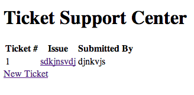

# Helpdesk

by Ali El-Ashram

## Description

A basic ticketing system that allows the user to submit tickets. These tickets will then be emailed to the support team, where they can reply to the message.

## Information

## Authors

* [Ali El-Ashram](https://aliel.herokuapp.com)

## Contributing

1. Fork it
2. Create your feature branch (`git checkout -b my-new-feature`)
3. Commit your changes (`git commit -am 'Add some feature'`)
4. Push to the branch (`git push origin my-new-feature`)
5. Create new Pull Request

## License

[MIT][2]

[2]: http://opensource.org/licenses/MIT
